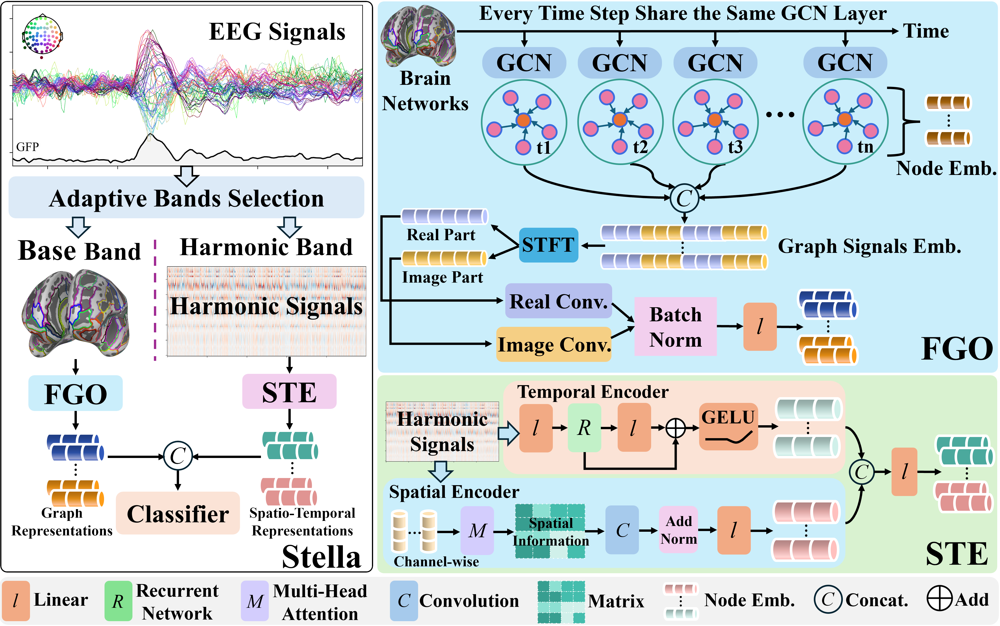

# README

# Towards Recognizing Spatial-temporal Collaboration of EEG Phase Brain Networks for Emotion Understanding

This repository contains the source code, experiment logs, and results for our paper. The proposed model is designed for subject-dependent emotion classification using spatial-temporal modeling of EEG phase-based brain networks.



## Abstract

Emotion recognition from EEG signals is crucial for understanding complex brain dynamics. Existing methods typically rely on static frequency bands and graph convolutional networks (GCNs) to model brain connectivity. However, EEG signals are inherently non-stationary and exhibit substantial individual variability, making static-band approaches inadequate for capturing their dynamic properties. Moreover, spatial-temporal dependencies in EEG often lead to feature degradation during node aggregation, ultimately limiting recognition performance. To address these challenges, we propose the \textbf{S}patial-\textbf{T}emporal \textbf{E}lectroencephalograph Co\textbf{lla}boration framework (\textbf{\allmodelname}). Our approach introduces an Adaptive Bands Selection module (\allmodelfeature) that dynamically extracts low- and high-frequency components, generating dual-path features comprising phase brain networks for connectivity modeling and time-series representations for local dynamics. To further mitigate feature degradation, the Fourier Graph Operator (\allmodelgraph) operates in the spectral domain, while the Spatial-Temporal Encoder (\allmodelencoder) enhances representation stability and density. Extensive experiments on benchmark EEG datasets demonstrate that~\allmodelname~achieves state-of-the-art performance in emotion recognition, offering valuable insights for graph-based modeling of non-stationary neural signals. The code is available at [this url](https://github.com/sun2017bupt/EEGBrainNetwork).

## 📁 Project Structure

- `home/eegall/Abla/*.out`
    
    Contains training logs and prediction results for ablation studies and baseline comparisons.
    
- `home/eegall/withlimits/*.txt`
    
    Includes text-based output logs of final prediction results under limited settings.
    
- `home/eegall/data/`
    
    Stores essential data files including preprocessed EEG signals, selected frequency bands, and intermediate variables used during model construction.
    
- `home/eegall/dataex/`
    
    Contains data used for plotting along with all visualization scripts and variable exports.
    
- `home/eegall/intermodel/`
    
    Stores trained model checkpoint files and related parameter configurations.
    
- `home/eegall/lossre/`
    
    Records the training loss values throughout the learning process.
    

## 🚀 Getting Started

### 🛠️ Environment Setup

```bash
# Clone the repository from GitHub
git clone https://github.com/sun2017bupt/EEGBrainNetwork.git
cd EEGBrainNetwork

# (Optional) Create a new Python environment using conda or virtualenv
conda create -n eeg python=3.8
conda activate eeg

# Install required Python packages
pip install -r requirements.txt
```

### 📦 Dataset Preparation

- Download and place the required EEG datasets (e.g., DEAP, FACED) into the `/data/` directory.
- Ensure dataset formats match the expected structure used by the code.
- For FACED, refer to `faceddata.py` for specific preprocessing requirements.

We use two publicly available EEG datasets widely used in affective computing:

- **DEAP Dataset** [[Koelstra et al., 2011]](https://www.eecs.qmul.ac.uk/mmv/datasets/deap/):
    
    A multimodal dataset containing EEG and peripheral physiological signals collected from 32 subjects while watching 40 emotion-eliciting music videos. Emotional ratings include arousal, valence, dominance, liking, and familiarity.
    
- **FACED Dataset** [[Chen et al., 2023]](https://www.synapse.org/Synapse:syn50614194/wiki/620378):
    
    A large-scale EEG emotion dataset collected from 123 participants watching 28 emotional video clips. It includes labels across 9 emotion categories (e.g., joy, fear, sadness), as well as arousal, valence, familiarity, and liking scores.
    

> Note: Please refer to the official dataset pages to request access or download:
> 
> - DEAP: [https://www.eecs.qmul.ac.uk/mmv/datasets/deap/](https://www.eecs.qmul.ac.uk/mmv/datasets/deap/)
> - FACED: [https://www.synapse.org/Synapse:syn50614194/wiki/620378](https://www.synapse.org/Synapse:syn50614194/wiki/620378)
> 
> The original datasets should be processed by the [`dataconstrut.py`](http://dataconstrut.py) to get the features.
> 

### 🏋️ Training

Run training with the following command (customize parameters as needed):

```bash
CUDA_VISIBLE_DEVICES=6 python main.py \
    --data='FACED' --loss='sce' --graph='base' --batch=11 --limit=1 \
    --seed=74 --valpage=6 --kfold=10 --maxiter=5000 --lr=0.00005 \
    --alpha=0.0008 --norm=1 --freq='BH' --ckpoint=0 --tylabel='Arousal' \
    --modeldir=10 --ablation=1 &
```

✅ **Tip:** You can adjust `--CUDA_VISIBLE_DEVICES` to the GPU index you want to use, and modify other flags to switch datasets, loss functions, graph types, and ablation settings.

### 🧪 Experimental Settings

We focus on **subject-dependent** EEG emotion recognition. Due to varying sampling durations across datasets, we adopt dataset-specific batch sizes:

- **DEAP**: batch size = 38
- **FACED**: batch size = 11

Other key settings:

- Learning rate: `5e-5`
- Training iterations: `5000`
- Optimizer: Adam
- Model parameters are initialized using **Xavier uniform initialization**
- No specific random seed is set

All experiments were conducted on an **NVIDIA A40 GPU server** with **Intel(R) Xeon(R) Gold 6148 CPU @ 2.40GHz**, using **PyTorch 1.11.0**.

### 🔑 Key Training Parameters

| Argument | Description | Example |
| --- | --- | --- |
| `--data` | Dataset name (`DEAP`, `FACED`) | `'FACED'` |
| `--loss` | Loss function (`sce`, others) | `'sce'` |
| `--graph` | Graph type (`base`, others) | `'base'` |
| `--batch` | Batch size | `11` |
| `--maxiter` | Max iterations | `5000` |
| `--kfold` | K-fold cross-validation splits | `10` |
| `--lr` | Learning rate | `0.00005` |
| `--alpha` | Weight decay (regularization) | `0.0008` |
| `--tylabel` | Label type (`Arousal`, `Valence`) | `'Arousal'` |
| `--ablation` | Whether to run ablation study (`0` or `1`) | `1` |

### 💾 Intermediate Saves

- Checkpoints will be saved in `/intermodel/`.
- Training loss records are saved in `/lossre/`.
- Final prediction results and ablation logs will appear under `/results/`, `/Abla/`, and `/withlimits/`.

## ⚙️ Loss Functions

The framework supports:

- Cross-Entropy Loss
- Extendable in `customloss.py` for custom-defined loss functions, **SCE Loss** (soft cross-entropy).

You can switch between different loss functions using the `--loss` argument.

## 🌟 Main Results


## 📊 Visualization

Use the scripts and notebooks under `/dataex/`, `analysismodel.ipynb`, or `explainmodel.ipynb` to generate:

- Training/validation loss curves
- Accuracy curves
- Brainnetwork construction


## 📧 Contact

For questions, feedback, or contributions, please contact: **sun2017@bupt.edu.cn.**